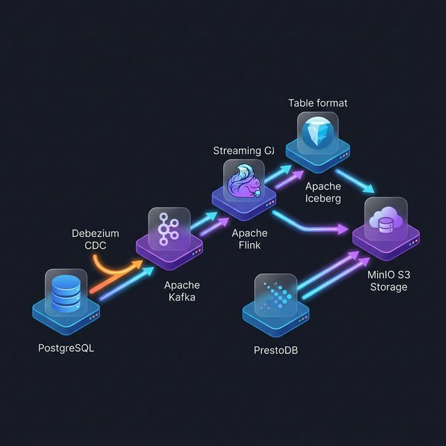

# 🚀 Real-Time Data Streaming Pipeline

A diploma project implementing a production-grade **real-time data streaming pipeline** using modern open-source Data Engineering tools. The system captures database changes in real-time and stores them in a Data Lake using the **Lakehouse architecture**.

## 🏗️ Architecture

```
PostgreSQL → Debezium (CDC) → Apache Kafka → Apache Flink → Apache Iceberg → MinIO
```



### Components

| Component | Version | Role |
|-----------|---------|------|
| **PostgreSQL** | 14 | Source operational database (`shop.orders` table) |
| **Debezium** | 2.4 | Change Data Capture (CDC) — reads PostgreSQL WAL log |
| **Apache Kafka** | (Debezium 2.4) | Message broker — topic `shop.shop.orders` |
| **Apache ZooKeeper** | (Debezium 2.4) | Kafka coordination service |
| **Apache Flink** | 1.17.2 | Stream processing engine — SQL-based ETL |
| **Apache Iceberg** | 1.4.3 | Open table format with ACID transactions |
| **MinIO** | latest | S3-compatible object storage (Data Lake) |

## 📊 Data Flow

1. **PostgreSQL** stores e-commerce orders in the `shop.orders` table
2. **Debezium** monitors the PostgreSQL WAL (Write-Ahead Log) and captures every INSERT, UPDATE, DELETE as a CDC event
3. **Apache Kafka** receives the CDC events as JSON messages in the `shop.shop.orders` topic
4. **Apache Flink** consumes the Kafka stream using `debezium-json` format and writes the data to an Iceberg table via a streaming SQL job with 10-second checkpointing
5. **Apache Iceberg** manages the table metadata (snapshots, manifests) and provides ACID transactions with upsert support (format-version 2)
6. **MinIO** stores the Iceberg data files (`.parquet`) and metadata (`.avro`, `.json`) in the `lakehouse-admin` bucket

## 🗂️ Project Structure

```
data-streaming-diploma/
├── docker-compose.yml          # All services configuration
├── flink_job.sql               # Flink SQL streaming job
├── init.sql                    # PostgreSQL schema & seed data
├── register-connector.json     # Debezium connector config template
└── flink/
    ├── Dockerfile              # Custom Flink image with S3/Iceberg JARs
    └── core-site.xml           # Hadoop S3A configuration for MinIO
```

## ⚙️ How It Works

### Flink SQL Job (`flink_job.sql`)
- Creates an **Iceberg catalog** backed by MinIO (S3A protocol)
- Defines a **Kafka source table** (`kafka_orders`) in the default catalog using `debezium-json` format
- Defines an **Iceberg sink table** (`iceberg_orders`) with upsert mode enabled
- Runs a continuous `INSERT INTO ... SELECT * FROM ...` streaming job
- Checkpointing every **10 seconds** to commit Iceberg snapshots to MinIO

### Data Lake Storage (MinIO)
```
lakehouse-admin/
└── iceberg_data/
    └── shop_analytics/
        └── iceberg_orders/
            ├── data/           ← Parquet data files
            └── metadata/       ← Iceberg snapshots, manifests, metadata JSON
```

## 🚀 Quick Start

### Prerequisites
- Docker Desktop
- Docker Compose

### 1. Start all services
```bash
docker-compose up -d
```

### 2. Wait for services to be ready (~30 seconds), then register the Debezium connector
```bash
curl -X POST http://localhost:8083/connectors \
  -H "Content-Type: application/json" \
  -d '{
    "name": "shop-connector",
    "config": {
      "connector.class": "io.debezium.connector.postgresql.PostgresConnector",
      "topic.prefix": "shop",
      "database.hostname": "postgres",
      "database.port": "5432",
      "database.user": "postgres",
      "database.password": "postgres",
      "database.dbname": "shop_db",
      "table.include.list": "shop.orders",
      "plugin.name": "pgoutput",
      "decimal.handling.mode": "double"
    }
  }'
```

### 3. Start the Flink streaming job
```bash
docker exec -it data-streaming-diploma-jobmanager-1 \
  /opt/flink/bin/sql-client.sh -f /opt/flink/flink_job.sql
```

### 4. Insert test data
```bash
docker exec -it data-streaming-diploma-postgres-1 \
  psql -U postgres -d shop_db \
  -c "INSERT INTO shop.orders (customer_name, product_id, price) VALUES ('Test User', 1, 99.99);"
```

### 5. Verify data in MinIO
Open MinIO Console at **http://localhost:9001** (admin / adminpassword)  
Navigate to: `lakehouse-admin → iceberg_data → shop_analytics → iceberg_orders → data/`

## 🌐 Service URLs

| Service | URL | Credentials |
|---------|-----|-------------|
| **Flink Dashboard** | http://localhost:8081 | — |
| **MinIO Console** | http://localhost:9001 | admin / adminpassword |
| **Kafka Connect (Debezium)** | http://localhost:8083 | — |
| **PostgreSQL** | localhost:5432 | postgres / postgres |

## 🔍 Monitoring

### Check Flink job status
```bash
curl http://localhost:8081/jobs
```

### Check Debezium connector status
```bash
curl http://localhost:8083/connectors/shop-connector/status
```

### Check Kafka topic messages
```bash
docker exec data-streaming-diploma-kafka-1 \
  /kafka/bin/kafka-console-consumer.sh \
  --bootstrap-server kafka:9092 \
  --topic shop.shop.orders \
  --from-beginning --max-messages 5
```

## 🏛️ Lakehouse Architecture

This project implements the **Lakehouse pattern** — combining the scalability and cost-efficiency of a Data Lake with the ACID transactions and schema enforcement of a Data Warehouse.

Key Iceberg features used:
- ✅ **Format version 2** — enables row-level deletes and upserts
- ✅ **UPSERT mode** — handles CDC UPDATE/DELETE operations correctly
- ✅ **Snapshot isolation** — every Flink checkpoint creates an atomic Iceberg snapshot
- ✅ **Time travel** — Iceberg metadata tracks all historical snapshots (v1, v2, v3...)
- ✅ **Open format** — Parquet data files can be read by Spark, Trino, DuckDB

## 📚 Technologies

- **Apache Flink 1.17.2** — stateful stream processing with exactly-once semantics
- **Apache Iceberg 1.4.3** — open table format (used by Netflix, Apple, LinkedIn)
- **Apache Kafka** — distributed event streaming
- **Debezium 2.4** — industry-standard CDC framework
- **MinIO** — high-performance S3-compatible object storage
- **PostgreSQL 14** — source transactional database
