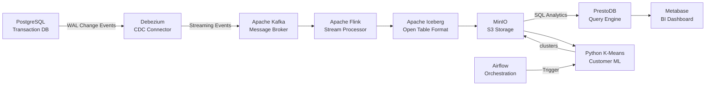
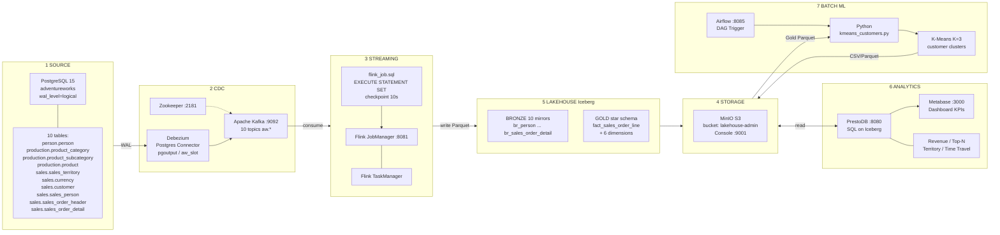
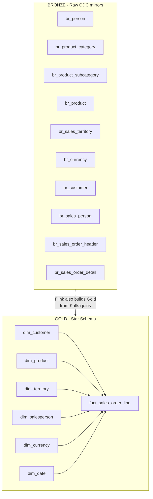

# დიაგრამების კოდი — ჩასვი mermaid.live-ზე

გახსენი https://mermaid.live  
დააკოპირე **ერთი** ბლოკი (მხოლოდ კოდი, სამი backtick-ის გარეშე თუ საიტი თავად ითხოვს plain text).

ეს არის შენი ძველი 2 სურათის **განახლებული** ვერსია (დამატებულია: Zookeeper, MinIO, Airflow, Python K-Means, Metabase).

---

## 1) მარტივი ჰორიზონტალური (შენი მეორე სურათის მსგავსი)



---

## 2) დეტალური 6+ ფენა (შენი პირველი სურათის მსგავსი, სრული)



---

## 3) Lakehouse შიგნით — Bronze + Gold Star (პირველი სურათის ცენტრი)



---

## 4) რა შეიცვალა ძველ სურათთან შედარებით

ძველ დიაგრამებში **არ იყო** / უნდა დაემატოს:

| დამატება | რატომ |
|----------|--------|
| **Zookeeper** | Kafka-ს კოორდინაცია |
| **MinIO** ცალკე storage ფენად | Iceberg ფაილები აქაა |
| **Airflow** | batch გაშვება |
| **Python K-Means** | კლიენტების სეგმენტაცია |
| **Metabase** | BI დეშბორდი Presto-ზე |

ძველ სურათში შეცდომა/განსხვავება:
- `address` ცხრილი **არ გაქვს** — წაშალე სიიდან
- Iceberg ცხრილები: Bronze 10 + Gold 7 (fact + 6 dim) ≈ **17**, არა აუცილებლად „16“

---

## 5) თუ Eraser / FigJam / draw.io-ში ხელით ხატავ

ტექსტური ბლოკები იგივე თანმიმდევრობით:

```
PostgreSQL (adventureworks, 10 tables, WAL)
    → Debezium (CDC, pgoutput)
    → Kafka (+ Zookeeper)  [10 topics aw.*]
    → Flink SQL (Bronze + Gold, checkpoint 10s)
    → Iceberg on MinIO (lakehouse-admin)
         ├─ Bronze: br_*
         └─ Gold: fact + dims
    → Presto → Metabase (BI)
    → Airflow Trigger → Python K-Means → MinIO analytics/customer_clusters/
```
