# პროექტის მაქსიმალურად დეტალური სქემა

გახსენი **https://mermaid.live** → ჩასვი **ერთი** `mermaid` ბლოკი ერთდროულად (მთელი ფაილი ერთად არ ჩასვა).

ფაილი: `docs/FULL_SCHEMA_KA.md`

---

# A. სრული არქიტექტურა (ყველა კომპონენტი + პორტები)

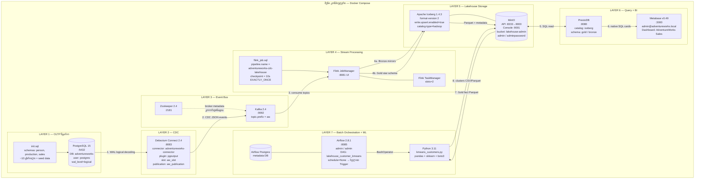

---

# B. ერთი INSERT-ის სრული გზა (რა ხდება შიგნით)

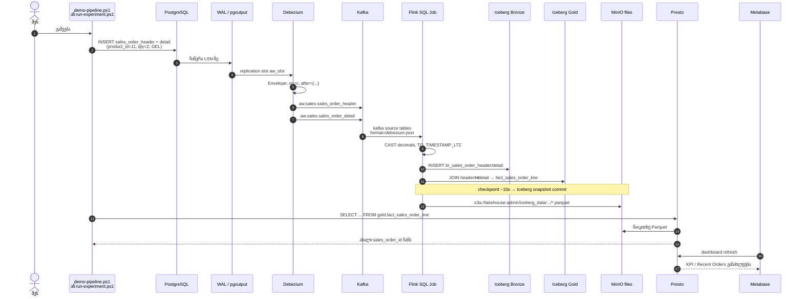

---

# C. PostgreSQL წყარო — ყველა ცხრილი

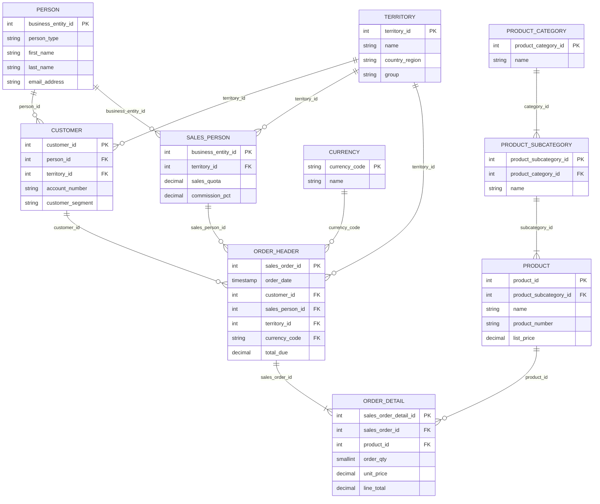

**Schemas:** `person` | `production` | `sales`  
**ფაილი:** `init.sql`

---

# D. Debezium → Kafka topics (1:1 ცხრილთან)

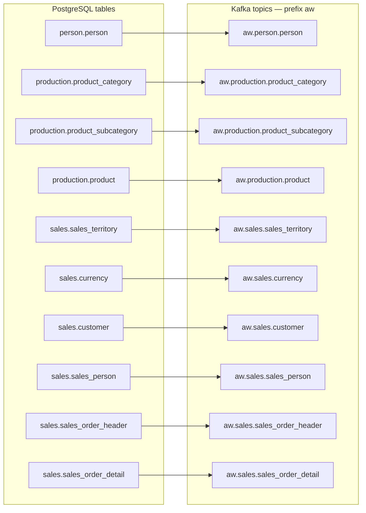

**კონფიგი:** `register-connector.json`  
- `snapshot.mode=initial` — პირველად მთელი ცხრილი  
- შემდეგ მხოლოდ ცვლილებები (op: c/u/d)  
- `decimal.handling.mode=string`

---

# E. Flink შიგნით — Kafka → Bronze → Gold

```mermaid
flowchart TB
  subgraph KAFKA_SRC["Flink Kafka source tables (default catalog)"]
    K1[kafka_person]
    K2[kafka_product_category]
    K3[kafka_product_subcategory]
    K4[kafka_product]
    K5[kafka_sales_territory]
    K6[kafka_currency]
    K7[kafka_customer]
    K8[kafka_sales_person]
    K9[kafka_sales_order_header]
    K10[kafka_sales_order_detail]
  end

  subgraph BRONZE["Iceberg Bronze — 1:1 raw mirrors"]
    B1[br_person]
    B2[br_product_category]
    B3[br_product_subcategory]
    B4[br_product]
    B5[br_sales_territory]
    B6[br_currency]
    B7[br_customer]
    B8[br_sales_person]
    B9[br_sales_order_header]
    B10[br_sales_order_detail]
  end

  subgraph GOLD_DIM["Iceberg Gold — Dimensions"]
    DC[dim_customer<br/>customer ⋈ person ⋈ territory]
    DP[dim_product<br/>product ⋈ subcategory ⋈ category]
    DT[dim_territory]
    DS[dim_salesperson<br/>salesperson ⋈ person ⋈ territory]
    DCur[dim_currency]
    DD[dim_date<br/>ერთჯერადი Presto SQL]
  end

  subgraph GOLD_FACT["Iceberg Gold — Fact"]
    F[fact_sales_order_line<br/>header ⋈ detail<br/>grain: order line]
  end

  K1 --> B1
  K2 --> B2
  K3 --> B3
  K4 --> B4
  K5 --> B5
  K6 --> B6
  K7 --> B7
  K8 --> B8
  K9 --> B9
  K10 --> B10

  K7 --> DC
  K1 --> DC
  K5 --> DC
  K4 --> DP
  K3 --> DP
  K2 --> DP
  K5 --> DT
  K8 --> DS
  K1 --> DS
  K5 --> DS
  K6 --> DCur
  K9 --> F
  K10 --> F
```

**ფაილი:** `flink_job.sql`  
**ერთი job:** `EXECUTE STATEMENT SET` — ყველა INSERT ერთად, atomic checkpoint.

---

# F. Gold Star Schema (ანალიტიკური მოდელი)

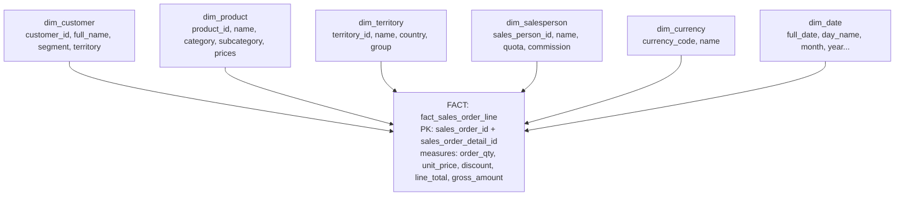

**Fact ველები (მთავარი):**  
`sales_order_id`, `sales_order_detail_id`, `order_ts`, `customer_id`, `product_id`, `territory_id`, `sales_person_id`, `currency_code`, `order_qty`, `unit_price`, `unit_price_discount`, `gross_amount`, `discount_amount`, `line_total`

---

# G. MinIO ფიზიკური სტრუქტურა

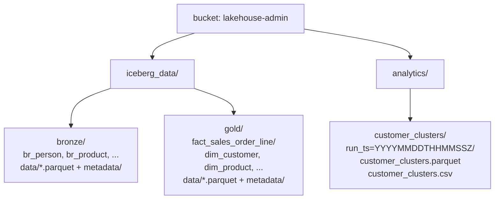

**Console:** http://localhost:9001  
**Flink წერს:** `s3a://lakehouse-admin/iceberg_data/`  
**K-Means წერს:** `s3://lakehouse-admin/analytics/customer_clusters/`

---

# H. Batch ML დეტალურად (Airflow + Python + K-Means)

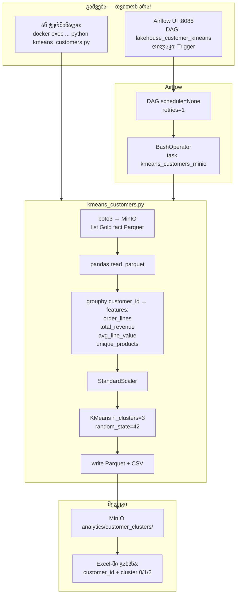

**რისთვის:** კლიენტების სეგმენტაცია (მცირე / საშუალო / VIP ტიპის ჯგუფები).  
**სად ვნახო:** MinIO, **არა** Metabase.

---

# I. BI ფენა (Presto + Metabase) დეტალურად

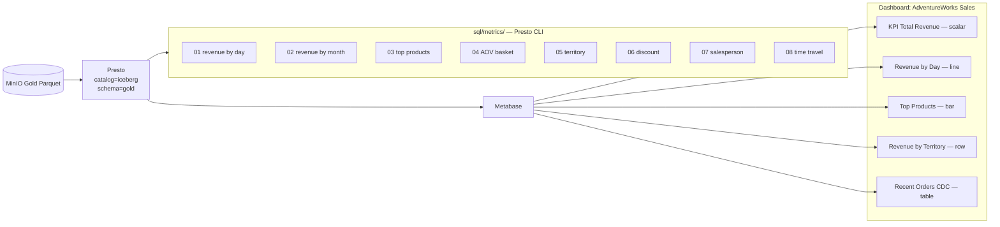

**Metabase ≠ K-Means.**  
Metabase = გაყიდვების ნახვა.  
K-Means = კლიენტების კლასტერები MinIO-ში.

---

# J. რა თვითონ მუშაობს vs რა უნდა გაუშვა

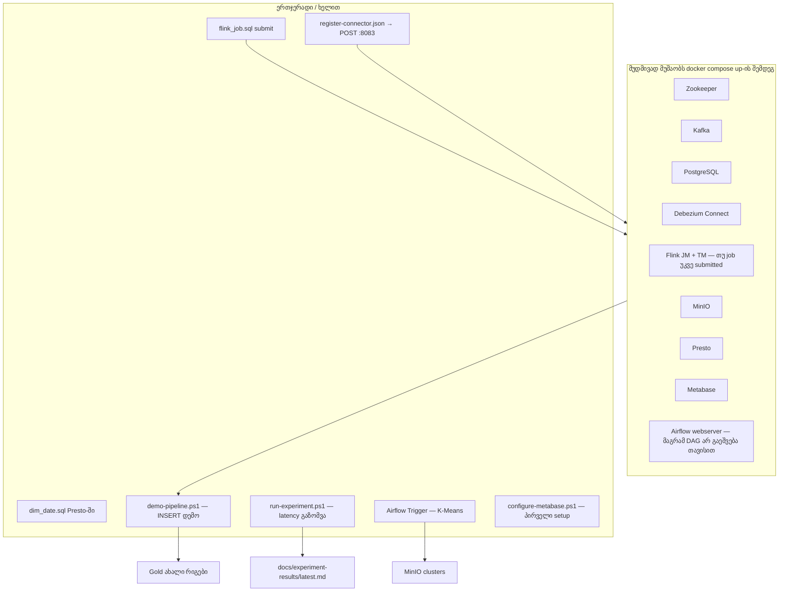

---

# K. სკრიპტები და რა აკეთებენ

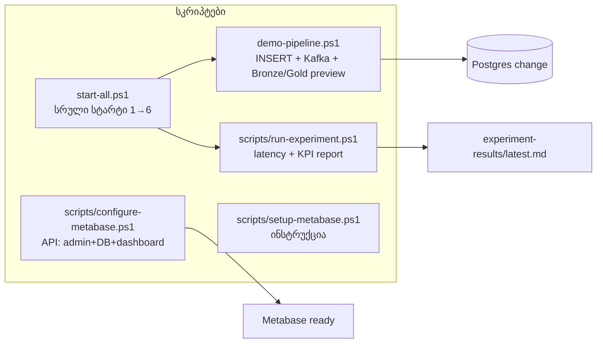

| სკრიპტი | რას აკეთებს | შედეგი სად |
|---------|-------------|------------|
| `docker compose up -d` | ყველა კონტეინერი | პორტები |
| `demo-pipeline.ps1` | CDC დემო INSERT | ტერმინალი + Gold |
| `run-experiment.ps1` | latency გაზომვა | `docs/experiment-results/` |
| Airflow Trigger | K-Means | MinIO `analytics/` |
| Metabase | BI ნახვა | http://localhost:3000/dashboard/1 |

---

# L. პორტების რუკა

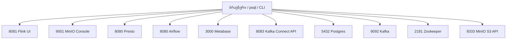

---

# M. პრეზენტაციის ერთი სლაიდი — „რა რატომ“

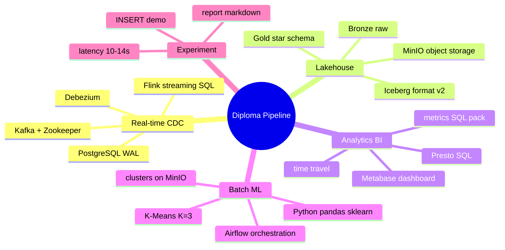

---

# N. მოკლე ლექსიკონი (დაცვაზე)

| ტერმინი | მნიშვნელობა შენს პროექტში |
|---------|---------------------------|
| **CDC** | Change Data Capture — მხოლოდ ცვლილებების კოპირება |
| **WAL** | Postgres-ის ტრანზაქციის ლოგი, საიდანაც Debezium კითხულობს |
| **Bronze** | ნედლი CDC სარკე, აუდიტისთვის |
| **Gold** | გაწმენდილი/მოდელირებული star schema ანალიტიკისთვის |
| **Iceberg** | ცხრილის ფორმატი Parquet-ზე (ACID, snapshot, time travel) |
| **MinIO** | S3-compatible დისკი/storage |
| **Flink** | streaming ძრავა — მუდმივად ამუშავებს event-ებს |
| **Airflow** | batch job-ის **გაშვების** მენეჯერი (არა ანალიზი) |
| **K-Means** | კლიენტების დაჯგუფება K ჯგუფად |
| **Metabase** | BI დეშბორდი Gold-ზე |
| **Presto** | SQL ძრავა Lakehouse-ზე |
| **Zookeeper** | Kafka-ს კოორდინატორი |

---

# O. რეკომენდებული ჩასმა mermaid.live-ზე (რიგით)

1. **A** — სრული არქიტექტურა (მთავარი სლაიდი)  
2. **B** — INSERT sequence (დემოს ახსნა)  
3. **F** — Star schema  
4. **H** — Airflow/K-Means  
5. **I** — Metabase  
6. **J** — რა ავტომატურია / რა ხელითაა  

დანარჩენი (C, D, E, G, K…) — დანართი / დოკუმენტაცია.
